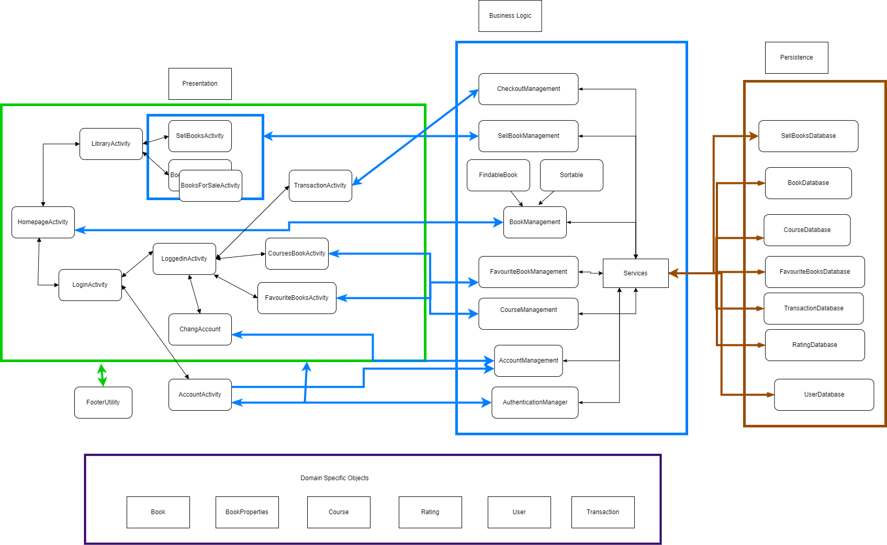
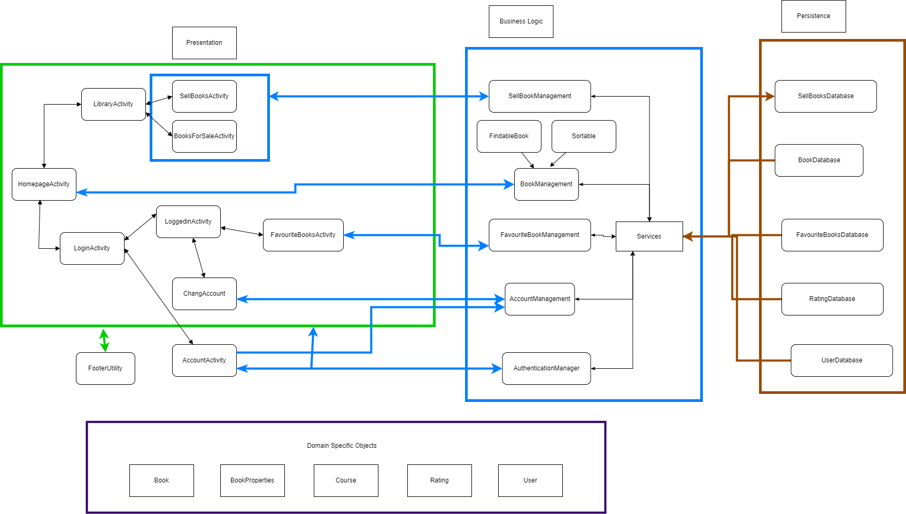

# Architecture

## Iteration 3 architecture diagram

## Iteration 2 architecture diagram

## Presentation Layer
---
[AccountActivity](https://code.cs.umanitoba.ca/comp3350-winter2024/techtitans-a01-9/-/blob/dev/app/src/main/java/com/example/myapplication/presentation/AccountActivity.java?ref_type=heads)
* The AccountActivity class manages account creation, allowing users to input details and select a role before registering.
  
[AddBookPopupActivity](https://code.cs.umanitoba.ca/comp3350-winter2024/techtitans-a01-9/-/blob/dev/app/src/main/java/com/example/myapplication/presentation/AddBookPopupActivity.java?ref_type=heads)
* The AddBookPopupActivity class facilitates adding books to courses by displaying a list of available books and enabling users to select and add them to a specific course(Partially implemented and still under construction).
  
[BookInfoActivity](https://code.cs.umanitoba.ca/comp3350-winter2024/techtitans-a01-9/-/blob/dev/app/src/main/java/com/example/myapplication/presentation/BookInfoActivity.java?ref_type=heads)
* e BookInfoActivity displays a book's details, enables saving it as a favorite, and simulates purchasing, alongside showing user ratings and comments.

[BooksForSaleActivity](https://code.cs.umanitoba.ca/comp3350-winter2024/techtitans-a01-9/-/blob/dev/app/src/main/java/com/example/myapplication/presentation/BooksForSaleActivity.java?ref_type=heads)
* The BooksForSaleActivity class is designed to display a list of books for sale by the authenticated user, featuring a layout for each book's details such as name, author, and price. It also includes a back navigation button to return to the LibraryActivity.

[ChangeAccount](https://code.cs.umanitoba.ca/comp3350-winter2024/techtitans-a01-9/-/blob/dev/app/src/main/java/com/example/myapplication/presentation/ChangeAccount.java?ref_type=heads)
* The ChangeAccount class allows users to update their account details, including username, address, and password.

[CheckoutActivity](https://code.cs.umanitoba.ca/comp3350-winter2024/techtitans-a01-9/-/blob/main/app/src/main/java/com/example/myapplication/presentation/CheckoutActivity.java?ref_type=heads)
* CheckoutActivity manages the checkout process, displaying cart items and facilitating order confirmation or cancellation in an Android app.

[CoursesBooksActivity](https://code.cs.umanitoba.ca/comp3350-winter2024/techtitans-a01-9/-/blob/dev/app/src/main/java/com/example/myapplication/presentation/CoursesBooksActivity.java?ref_type=heads)
* The CoursesBooksActivity class displays courses and their required books, allowing users to add new courses and books, and providing functionalities to delete books from courses.(Partially implemented and still under construction)

[FavoriteBooksActivity](https://code.cs.umanitoba.ca/comp3350-winter2024/techtitans-a01-9/-/blob/main/app/src/main/java/com/example/myapplication/presentation/FavouriteBooksActivity.java?ref_type=heads)
* FavouriteBooksActivity displays a user's favorite books, allowing them to delete books from favorites or add them to the shopping cart within an Android application.

[HomePageActivity](https://code.cs.umanitoba.ca/comp3350-winter2024/techtitans-a01-9/-/blob/dev/app/src/main/java/com/example/myapplication/presentation/HomePageActivity.java?ref_type=heads)
* The HomePageActivity class displays and allows searching and sorting of books, and facilitates navigation to detailed book information.

[LibraryActivity](https://code.cs.umanitoba.ca/comp3350-winter2024/techtitans-a01-9/-/blob/dev/app/src/main/java/com/example/myapplication/presentation/LibraryActivity.java?ref_type=heads)
* The LibraryActivity class provides navigation options within the app to sell books and view books for sale, each through its respective activity.

[LoggedinActivity](https://code.cs.umanitoba.ca/comp3350-winter2024/techtitans-a01-9/-/blob/dev/app/src/main/java/com/example/myapplication/presentation/LoggedinActivity.java?ref_type=heads)
* The LoggedinActivity class provides logged-in users with options to view and edit their account information via the ChangeAccount activity, and to view required course books through the CoursesBooksActivity, facilitating navigation.

[LoginActivity](https://code.cs.umanitoba.ca/comp3350-winter2024/techtitans-a01-9/-/blob/dev/app/src/main/java/com/example/myapplication/presentation/LoginActivity.java?ref_type=heads)
* The LoginActivity class handles user login, offering options to log in, sign up, and navigate back to the home page

[SellBooksActivity](https://code.cs.umanitoba.ca/comp3350-winter2024/techtitans-a01-9/-/blob/dev/app/src/main/java/com/example/myapplication/presentation/SellBooksActivity.java?ref_type=heads)
* The SellBooksActivity class enables users to sell books by entering details and managing the sale through SellBooksManagement, with navigation to the LibraryActivity upon successful operation.

[TransactionsActivity](https://code.cs.umanitoba.ca/comp3350-winter2024/techtitans-a01-9/-/blob/main/app/src/main/java/com/example/myapplication/presentation/TransactionsActivity.java?ref_type=heads)
* TransactionsActivity displays a user's past purchase history, including book details and delivery information, in an Android application.

### Presentation/utils
[FooterUtility](https://code.cs.umanitoba.ca/comp3350-winter2024/techtitans-a01-9/-/blob/dev/app/src/main/java/com/example/myapplication/presentation/FooterUtility.java?ref_type=heads)
* The FooterUtility class initializes footer buttons for navigation to profile, home, and library activities in an app, based on user authentication.

[BooksUtility](https://code.cs.umanitoba.ca/comp3350-winter2024/techtitans-a01-9/-/blob/main/app/src/main/java/com/example/myapplication/presentation/utils/BooksUtility.java?ref_type=heads)
* The BooksUtility class dynamically displays a list of books in a given LinearLayout, including book details and a delete option, within an Android application.

## Application Layer
---
[Main](https://code.cs.umanitoba.ca/comp3350-winter2024/techtitans-a01-9/-/blob/dev/app/src/main/java/com/example/myapplication/application/Main.java?ref_type=heads)
* The Main class configures the database name for the BookEase application and initializes a JDBC driver.

[Services](https://code.cs.umanitoba.ca/comp3350-winter2024/techtitans-a01-9/-/blob/dev/app/src/main/java/com/example/myapplication/application/Services.java?ref_type=heads)
* The Services class provides singleton access to various databases (book, user, sell books, and favorite books) within the application, initializing them with the database path name obtained from the Main class.

## Business Layer

### authentication
[Authenticate](https://code.cs.umanitoba.ca/comp3350-winter2024/techtitans-a01-9/-/blob/dev/app/src/main/java/com/example/myapplication/business/authentication/Authenticate.java?ref_type=heads)
* The Authenticate interface specifies a method for user authentication by username and password.

[AuthenticatedUser](https://code.cs.umanitoba.ca/comp3350-winter2024/techtitans-a01-9/-/blob/dev/app/src/main/java/com/example/myapplication/business/authentication/AuthenticatedUser.java?ref_type=heads)
* The AuthenticatedUser class implements a singleton pattern to manage the currently authenticated user's information within the application, allowing access to and modification of the user details.

### Management
[AccountManagement](https://code.cs.umanitoba.ca/comp3350-winter2024/techtitans-a01-9/-/blob/dev/app/src/main/java/com/example/myapplication/business/management/AccountManagement.java?ref_type=heads)
* The AccountManagement class handles account creation and updates, including validation checks, for users within the application, utilizing a UserDatabase.

[AuthenticationManager](https://code.cs.umanitoba.ca/comp3350-winter2024/techtitans-a01-9/-/blob/dev/app/src/main/java/com/example/myapplication/business/management/AuthenticationManager.java?ref_type=heads)
* The AuthenticationManager class implements user authentication against a UserDatabase and manages the session of the authenticated user.

[BookManagement](https://code.cs.umanitoba.ca/comp3350-winter2024/techtitans-a01-9/-/blob/dev/app/src/main/java/com/example/myapplication/business/BookManagement.java?ref_type=heads)
* The BookManagement class manages book retrieval and sorting operations using a BookDatabase.
  
[CheckoutManagement](https://code.cs.umanitoba.ca/comp3350-winter2024/techtitans-a01-9/-/blob/main/app/src/main/java/com/example/myapplication/business/management/CheckoutManagement.java?ref_type=heads)
* The CheckoutManagement class handles shopping cart operations for book purchases, including adding/removing books, finalizing transactions, and retrieving past purchases, with a flawed singleton pattern implementation.

[CourseManagement](https://code.cs.umanitoba.ca/comp3350-winter2024/techtitans-a01-9/-/blob/dev/app/src/main/java/com/example/myapplication/business/management/CourseManagement.java?ref_type=heads)
* The CourseManagement class handles course creation, book assignment, and provides course details, with validations for course and book operations(Unfinished still under construction).

[FavouriteBookManagement](https://code.cs.umanitoba.ca/comp3350-winter2024/techtitans-a01-9/-/blob/dev/app/src/main/java/com/example/myapplication/business/management/FavouriteBookManagement.java?ref_type=heads)
* The FavouriteBookManagement class handles adding, removing, and retrieving a user's favorite books using a FavoriteBooksDatabase.

[FindableBook](https://code.cs.umanitoba.ca/comp3350-winter2024/techtitans-a01-9/-/blob/dev/app/src/main/java/com/example/myapplication/business/management/FindableBook.java?ref_type=heads)
* The FindableBook interface defines methods for viewing, searching books by name, ID, and author, facilitating book retrieval operations.

[SellBooksManagement](https://code.cs.umanitoba.ca/comp3350-winter2024/techtitans-a01-9/-/blob/dev/app/src/main/java/com/example/myapplication/business/management/SellBooksManagement.java?ref_type=heads)
* The SellBooksManagement class facilitates the sale of books by verifying book existence and adding them to a sales database with specified conditions and price.

[Sortable](https://code.cs.umanitoba.ca/comp3350-winter2024/techtitans-a01-9/-/blob/dev/app/src/main/java/com/example/myapplication/business/management/Sortable.java?ref_type=heads)
* The Sortable interface defines methods for sorting lists of books by price, book name, and rating.

## Persistence Layer
---
[Database](https://code.cs.umanitoba.ca/comp3350-winter2024/techtitans-a01-9/-/blob/dev/app/src/main/java/com/example/myapplication/persistence/Database.java?ref_type=heads)

### Implementation

[BookDatabaseImpl](https://code.cs.umanitoba.ca/comp3350-winter2024/techtitans-a01-9/-/blob/dev/app/src/main/java/com/example/myapplication/persistence/implementation/BookDatabaseImpl.java?ref_type=heads)
* The BookDatabaseImpl class implements the BookDatabase interface, managing book-related operations such as retrieval, addition, and search in a database.
  
[CourseRequiredDatabaseImpl](https://code.cs.umanitoba.ca/comp3350-winter2024/techtitans-a01-9/-/blob/main/app/src/main/java/com/example/myapplication/persistence/implementation/CourseRequiredBookDatabaseImpl.java?ref_type=heads)
* The CourseRequiredBookDatabaseImpl class implements functionality to manage course-required books, allowing operations such as retrieving course lists with their required books, adding, and deleting books from courses in a database.

[FavoriteBooksDatabaseImpl](https://code.cs.umanitoba.ca/comp3350-winter2024/techtitans-a01-9/-/blob/dev/app/src/main/java/com/example/myapplication/persistence/implementation/FavoriteBooksDatabaseImpl.java?ref_type=heads)
* The FavoriteBooksDatabaseImpl manages favorite books in a database, handling additions, deletions, and queries with transaction support and integrity checks.

[RatingDatabaseImpl](https://code.cs.umanitoba.ca/comp3350-winter2024/techtitans-a01-9/-/blob/dev/app/src/main/java/com/example/myapplication/persistence/implementation/RatingDatabaseImpl.java?ref_type=heads)
* The RatingDatabaseImpl class manages ratings in a database, enabling the addition of ratings with comments and retrieval of ratings for a specific book, with transaction support.

[SellBooksDatabaseImpl](https://code.cs.umanitoba.ca/comp3350-winter2024/techtitans-a01-9/-/blob/dev/app/src/main/java/com/example/myapplication/persistence/implementation/SellBooksDatabaseImpl.java?ref_type=heads)
* The SellBooksDatabaseImpl handles database transactions for adding, deleting, and listing books for sale, ensuring data integrity through managed transactions.

[TransactionDatabaseImpl](https://code.cs.umanitoba.ca/comp3350-winter2024/techtitans-a01-9/-/blob/main/app/src/main/java/com/example/myapplication/persistence/implementation/TransactionDatabaseImpl.java?ref_type=heads)
* The TransactionDatabaseImpl class manages transaction-related operations, such as retrieving a user's purchase history and handling the deletion of books for sale while recording the transactions in a database.

[UserDatabaseImpl](https://code.cs.umanitoba.ca/comp3350-winter2024/techtitans-a01-9/-/blob/dev/app/src/main/java/com/example/myapplication/persistence/implementation/UserDatabaseImpl.java?ref_type=heads)
* The UserDatabaseImpl handles database operations for users, including search, add, and update actions, with SQL transaction management for data integrity.

### stub
[DummyDatabase](https://code.cs.umanitoba.ca/comp3350-winter2024/techtitans-a01-9/-/blob/dev/app/src/main/java/com/example/myapplication/persistence/stub/DummyDatabase.java?ref_type=heads)
* The DummyDatabase is an in-memory stub for user and book data operations, supporting basic add and find functionalities, and used for testing without real database interaction.
  
#### stub/utils
[RandomGenerator](https://code.cs.umanitoba.ca/comp3350-winter2024/techtitans-a01-9/-/blob/dev/app/src/main/java/com/example/myapplication/business/utlis/RandomGenerator.java?ref_type=heads)
* The RandomGenerator class provides methods to generate random names, addresses, book names, prices, editions, author names, ratings, and comments for testing or placeholder content.

### subinterfaces
[BookDatabase](https://code.cs.umanitoba.ca/comp3350-winter2024/techtitans-a01-9/-/blob/dev/app/src/main/java/com/example/myapplication/persistence/subinterfaces/BookDatabase.java?ref_type=heads)
* The BookDatabase interface outlines methods for managing and querying book data within a database.

[CourseRequiredBookDatabase](https://code.cs.umanitoba.ca/comp3350-winter2024/techtitans-a01-9/-/blob/main/app/src/main/java/com/example/myapplication/persistence/subinterfaces/CourseRequiredBookDatabase.java?ref_type=heads)
* The CourseRequiredBookDatabase interface manages course book requirements, supporting listing, adding, and removing books, with error handling via BadCourseException.

[FavoriteBooksDatabase](https://code.cs.umanitoba.ca/comp3350-winter2024/techtitans-a01-9/-/blob/dev/app/src/main/java/com/example/myapplication/persistence/subinterfaces/FavoriteBooksDatabase.java?ref_type=heads)
* The FavoriteBooksDatabase interface defines methods for managing a user's favorite books, including retrieving, adding, and deleting favorites.

[RatingDatabase](https://code.cs.umanitoba.ca/comp3350-winter2024/techtitans-a01-9/-/blob/dev/app/src/main/java/com/example/myapplication/persistence/subinterfaces/RatingDatabase.java?ref_type=heads)
* The RatingDatabase interface specifies methods for adding ratings with comments to books and retrieving all ratings for a specific book.

[SellBooksDatabase](https://code.cs.umanitoba.ca/comp3350-winter2024/techtitans-a01-9/-/blob/dev/app/src/main/java/com/example/myapplication/persistence/subinterfaces/SellBooksDatabase.java?ref_type=heads)
* The SellBooksDatabase interface defines methods for managing books for sale, including retrieving a user's sale books, adding, and deleting sale books.

[TransactionDatabase](https://code.cs.umanitoba.ca/comp3350-winter2024/techtitans-a01-9/-/blob/main/app/src/main/java/com/example/myapplication/persistence/subinterfaces/TransactionDatabase.java?ref_type=heads)
* The TransactionDatabase interface extends the Database interface, defining methods for retrieving a user's purchase history and deleting a book for sale, with both methods capable of throwing a CheckoutException.

[UserDatabase](https://code.cs.umanitoba.ca/comp3350-winter2024/techtitans-a01-9/-/blob/dev/app/src/main/java/com/example/myapplication/persistence/subinterfaces/UserDatabase.java?ref_type=heads)
* The UserDatabase interface specifies operations for finding, adding, and updating user information in a database.

### utils
[DBHelper](https://code.cs.umanitoba.ca/comp3350-winter2024/techtitans-a01-9/-/blob/dev/app/src/main/java/com/example/myapplication/persistence/utils/DBHelper.java?ref_type=heads)
* The DBHelper class copies the app's database from assets to internal storage and supports resetting the database, updating its path via the Main class.

## Domain Specific Objects
[Book](https://code.cs.umanitoba.ca/comp3350-winter2024/techtitans-a01-9/-/blob/dev/app/src/main/java/com/example/myapplication/Models/Book.java?ref_type=heads)
* The Book class models book entities with properties like ID, name, price, author, and condition, along with functionality to add and manage ratings.

[BookProperties](https://code.cs.umanitoba.ca/comp3350-winter2024/techtitans-a01-9/-/blob/dev/app/src/main/java/com/example/myapplication/Models/BookProperties.java?ref_type=heads)
* The BookProperties class encapsulates the descriptive attributes of a book, including condition, edition, and ratings, along with methods to manage and calculate the overall rating.

[Course](https://code.cs.umanitoba.ca/comp3350-winter2024/techtitans-a01-9/-/blob/dev/app/src/main/java/com/example/myapplication/Models/Course.java?ref_type=heads)
* The Course class represents a course with attributes like ID and name, and manages a set of required book IDs.

[Rating](https://code.cs.umanitoba.ca/comp3350-winter2024/techtitans-a01-9/-/blob/dev/app/src/main/java/com/example/myapplication/Models/Rating.java?ref_type=heads)
* The Rating class represents a book rating with a score, comment, and author ID, including validation for rating values and ownership checks for modifications.

[Transaction](https://code.cs.umanitoba.ca/comp3350-winter2024/techtitans-a01-9/-/blob/main/app/src/main/java/com/example/myapplication/Models/Transaction.java?ref_type=heads)
* The Transaction class models a purchase, including delivery details, the book purchased, and the price paid, with methods to access these attributes.

[User](https://code.cs.umanitoba.ca/comp3350-winter2024/techtitans-a01-9/-/blob/dev/app/src/main/java/com/example/myapplication/Models/User.java?ref_type=heads)
* The User class models a user with attributes like name, password, type, and address, supporting operations like password check, update, and managing a list of books for sale.

