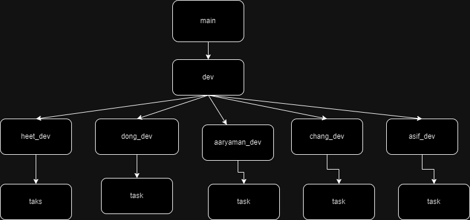

# Contribution

## Diagram
---

## Description
---
1) There is a main branch for submission of the project. 
2) There is a dev branch checked out from the main, using this 
	dev branch there where 5 checkouts for each team member in their name. 
3) Each members from there got a new sub-branch for implementing the user stories.
