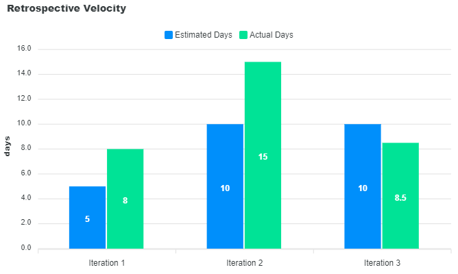

# Retrospective
---

## What went wrong?
---
During the course of iteration two, the team encountered significant challenges in meeting the predefined deadlines for their assigned tasks. This misalignment in task distribution and completion timelines has led to a situation where several critical tasks remained unfinished by the end of the iteration. Among the most notable concerns was the inadequate test coverage that, as a consequence, left the project exposed to potential undetected errors. Consequently, it has been decided that these unresolved issues will be carried over as technical debts into the next iteration, necessitating immediate attention to prevent compounding problems.

A substantial portion of iteration three was dedicated to code refactoring and the resolution of identified bugs. This focus, while necessary for maintaining the integrity and performance of the codebase, inadvertently contributed to the shortfall in progress on new features and enhancements. Recognizing the importance of robust testing practices, the upcoming iteration will include a significant emphasis on expanding the project's test coverage. Team members will be tasked with writing comprehensive unit tests aimed at validating both existing and newly introduced functionalities. This effort is critical for ensuring the reliability of the application and mitigating the risk of future technical debts.

In response to the challenges faced during this iteration, the team plans to implement strategic adjustments to their workflow and task management approaches. These adjustments will include more realistic task allocations, taking into account each team member's capacity and skill set, as well as the establishment of more frequent check-ins to monitor progress and address bottlenecks promptly. By adopting a more flexible and responsive approach to project management, the team aims to enhance collaboration and efficiency, ultimately driving the successful completion of iteration four and beyond.

Additionally, the experience from iteration three has underscored the necessity of fostering a culture that prioritizes quality assurance and thorough testing as integral components of the development process. Investing time and resources in these areas will not only reduce the incidence of bugs and technical debts but also contribute to a more stable and reliable software product. The team remains committed to learning from the setbacks experienced during this iteration and leveraging these insights to improve their methodologies and outcomes in future iterations.

## How can we improve this iteration?
To address the challenges faced in the previous iteration, we are implementing a strategic overhaul of our task management approach. Our focus is on prioritizing tasks based on urgency and importance and ensuring an equitable distribution of these tasks among team members according to their skills and workload. This adjustment aims to leverage individual strengths and maintain balanced progress across all project components.

Key Strategies and Metrics of Success
Task Prioritization and Distribution: Tasks will be categorized and assigned to align with team members’ expertise and capacity, with a flexible model that allows for adjustments based on regular progress reviews. This approach ensures that workloads are manageable and aligned with project milestones.

Measurement of Success: We will measure our effectiveness through two main metrics:

* Test Coverage: Setting and achieving test coverage targets will indicate the quality and reliability of our software, reflecting our commitment to reducing bugs and enhancing stability.
* Time Efficiency: Monitoring the time spent on tasks will help us gauge our efficiency, with success marked by adherence to allocated timeframes, ensuring the project stays on track.

## Project Velocity Chart from Pervious Iterations
